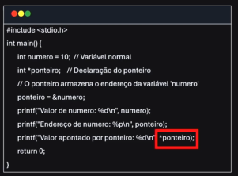
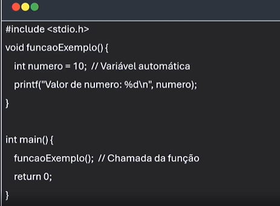
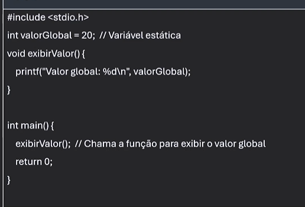
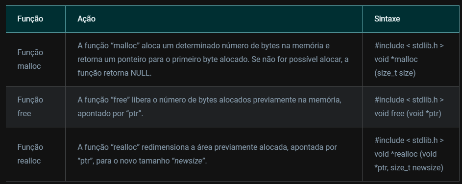

# Estrutura de Dados Heterogênea

## Memória de um computador

- RAM: Random Access Memory
    "mesa de trabalho"
- HD ou SSD - Hard Disk ou Solid State Drive
    "memoria permanente"
- Cache
- memória virtual
- memória ROM
    "memória essencial para a execução do computador"

## Regiões de memória

- Stack (pilhas)
- Heap (Área de alocação dinâmica)
    "enquanto o programa esta em execução"
- Data Segment (Variaveis globais e estaticas sao armazenadas)
- Code Segment (instruções de execução)

## Ponteiro

É uma variável que contém um endereço de memória

- Acessar e manipular memória dinamicamente
- Passagem de Parâmetros por referencia
- Otimização de performance

## Alocação em Memória

Como os dados sao armazenados e manpulados quando o programa está em execução

Reservar um espaço na memória

Tipos de alocação:
    - Automática
        Geralmente alocada em DATA. Exemplo, a variável número: 
    - Estática
        Permanecem na memória durante toda a execução do programa, exemplo valorGlobal:
    - Dinâmica
        Permite que o programa reserve memória conforme a necessidade

Função malloc (Memory Allocation)
    - Recebe o numero de bytes que queremos alocar
Função calloc
    - REcebe  o numero de elementos e o tamanho
Função Free
    - ponteiro para o bloco de memório a ser liberado



## Exemplo função malloc

    ``` c
    // Alocar em meória 5 inteiros
    #include <stdio.h>
    #include <stdlib.h>

    int main(){
        int *ponteiro;
        ponteiro = (int*) malloc(5 * sizeof(int)); // aloca memória para 5 inteiros

        if (ponteiro != NULL) {
            int i;
            for (i = 0; i < 5; i++) {
                ponteiro[i] = i + 1;
            }

            for (i = 0; i < 5; i++) {
                printf("%d ", ponteiro[i]);
            }

            free(ponteiro);
        } else {
            printf("Erro de alocação de memoria");
        }
        
    }

    ```

## Exemplo função calloc

    ``` c
    #include <stdio.h>
    #include <stdlib.h>

    int main(){
        int *ponteiro;
        ponteiro = (int*) calloc(5, sizeof(int)); // aloca memória para 5 inteiros

        if (ponteiro != NULL) {
            int i;
            for (i = 0; i < 5; i++) {
                printf("%d ", ponteiro[i]);
            }

            free(ponteiro);
        } else {
            printf("Erro de alocação de memoria");
        }
        
    }

    ```

## Declaração e definição de Struct em c

- É como um pacote organizado que permite armazenar diferentes tipos de dados dentro de uma unica unidade. Dados Heterogêneos.

Exemplo:

    ``` c
    struct Pessoa {
        char nome[50];
        int idade;
        char telefone[15];
        };

    ```

Exemplo:

    ``` c
        #include <stdio.h>
    #include <string.h>

    struct Pessoa {
            char nome[50];
            int idade;
            char telefone[15];
    };

    int main() {
        struct Pessoa lista[3];
        int i;

        // preenchendo as informações para cada pessoa
        strcpy(lista[0].nome, "Alana");
        lista[0].idade = 18;
        strcpy(lista[0].telefone, "12345-6789");
        
        strcpy(lista[1].nome, "Lucas");
        lista[1].idade = 12;
        strcpy(lista[1].telefone, "98765-4321");
        
        strcpy(lista[2].nome, "Julia");
        lista[2].idade = 7;
        strcpy(lista[2].telefone, "54321-6789");
        
        // imprimindo as informações
        for (i = 0; i < 3; i++) {
            printf("Nome: %s\n", lista[i].nome);
            printf("Idade: %d\n", lista[i].idade);
            printf("Telefone: %s\n\n", lista[i].telefone);
        };

        return 0;
        
    };
    ```

## Struc Aninhadas

Exemplo:

    ``` c
    #include <stdio.h>
    #include <string.h>

    struct Disciplina {
            char nome[30];
            char professor[50];
            int cargaHoraria;
    };

    struct Aluno {
            char nome[50];
            int idade;
            int matricula;
            // Struct curso aninhada dentro de Aluno
            struct Disciplina disciplina[3]; // 3 registros
    };


    void cadastrarDisciplina(struct Disciplina *disciplina, const char *nome, const char *professor, int cargaHoraria) {
        strcpy(disciplina->nome, nome);
        strcpy(disciplina->professor, professor);
        disciplina->cargaHoraria = cargaHoraria;
    };

    void cadastrarAluno(struct Aluno *aluno, const char *nome, int idade, int matricula) {
        strcpy(aluno->nome, nome);
        aluno->idade = idade;
        aluno->matricula = matricula;

        cadastrarDisciplina(&aluno->disciplina[0], "Matematica", "Prof Joao", 60);
        cadastrarDisciplina(&aluno->disciplina[1], "Historia", "Prof Maria", 45);
        cadastrarDisciplina(&aluno->disciplina[2], "Quimica", "Prof Carlos", 50);
    };

    void exibirAluno(struct Aluno *aluno) {
        int i;

        printf("Nome do aluno: %s\n", aluno->nome);
        printf("Idade: %d\n", aluno->idade);
        printf("Matricula: %d\n", aluno->matricula);

        printf("Disciplinas: \n");
        for (i = 0; i < 3; i++) {
            printf(" Disciplina %d: \n", i +1);
            printf(" Nome: %s\n", aluno->disciplina[i].nome);
            printf(" Professor: %s\n", aluno->disciplina[i].professor);
            printf(" Carga horaria: %d horas\n", aluno->disciplina[i].cargaHoraria);
        };

        
    };

    int main() {
        struct Aluno aluno1;

        cadastrarAluno(&aluno1, "Alana", 20, 1234);
        exibirAluno(&aluno1);

        return 0;
        
        };
    ```

## Array de Structs

É um estrutura que armazena vários elementos do mesmo tipo em uma sequencia.
