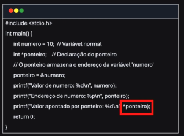
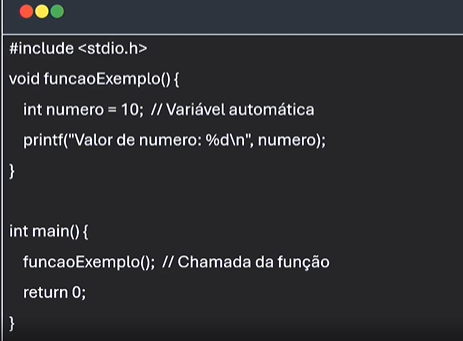
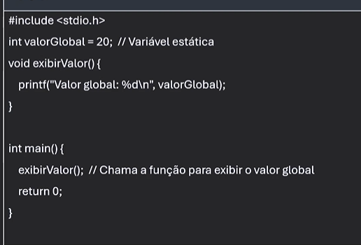
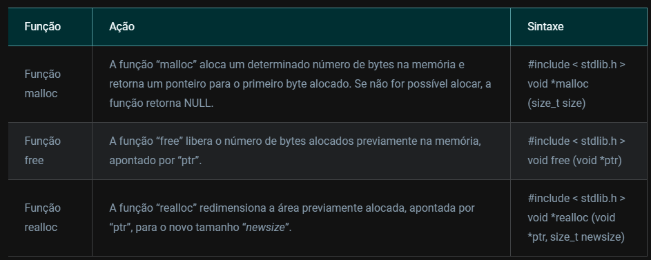

# Estrutura de Dados Heterogênea

## Memória de um computador

- RAM: Random Access Memory
    "mesa de trabalho"
- HD ou SSD - Hard Disk ou Solid State Drive
    "memoria permanente"
- Cache
- memória virtual
- memória ROM
    "memória essencial para a execução do computador"

## Regiões de memória

- Stack (pilhas)
- Heap (Área de alocação dinâmica)
    "enquanto o programa esta em execução"
- Data Segment (Variaveis globais e estaticas sao armazenadas)
- Code Segment (instruções de execução)

## Ponteiro

É uma variável que contém um endereço de memória

- Acessar e manipular memória dinamicamente
- Passagem de Parâmetros por referencia
- Otimização de performance

## Alocação em Memória

Como os dados sao armazenados e manpulados quando o programa está em execução

Reservar um espaço na memória

Tipos de alocação:
    - Automática
        Geralmente alocada em DATA. Exemplo, a variável número: 
    - Estática
        Permanecem na memória durante toda a execução do programa, exemplo valorGlobal:
    - Dinâmica
        Permite que o programa reserve memória conforme a necessidade

Função malloc (Memory Allocation)
    - Recebe o numero de bytes que queremos alocar
Função calloc
    - REcebe  o numero de elementos e o tamanho
Função Free
    - ponteiro para o bloco de memório a ser liberado



## Exemplo função malloc

    ``` c
    // Alocar em meória 5 inteiros
    #include <stdio.h>
    #include <stdlib.h>

    int main(){
        int *ponteiro;
        ponteiro = (int*) malloc(5 * sizeof(int)); // aloca memória para 5 inteiros

        if (ponteiro != NULL) {
            int i;
            for (i = 0; i < 5; i++) {
                ponteiro[i] = i + 1;
            }

            for (i = 0; i < 5; i++) {
                printf("%d ", ponteiro[i]);
            }

            free(ponteiro);
        } else {
            printf("Erro de alocação de memoria");
        }
        
    }

    ```

## Exemplo função calloc

    ``` c
    #include <stdio.h>
    #include <stdlib.h>

    int main(){
        int *ponteiro;
        ponteiro = (int*) calloc(5, sizeof(int)); // aloca memória para 5 inteiros

        if (ponteiro != NULL) {
            int i;
            for (i = 0; i < 5; i++) {
                printf("%d ", ponteiro[i]);
            }

            free(ponteiro);
        } else {
            printf("Erro de alocação de memoria");
        }
        
    }

    ```
